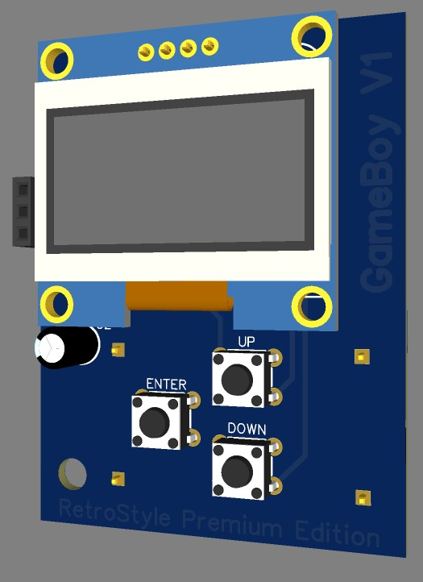

# 
<b>GameBoy</b>

### 
<b>Simple code to make Old School style GameBoy using Attiny85</b>

  

## Available Games
- Dino Game
- Flappy Bird
- Pong Game
  - Will be added
    - Tic tac

## Needed Components
- Arduino IDE App
- Attiny85 Chip
- Oled Display 0.96"
- 3x arduino Buttons
- 3X Resistor with 10K Ohm
- Arduino Breadboard or Universal PCB

